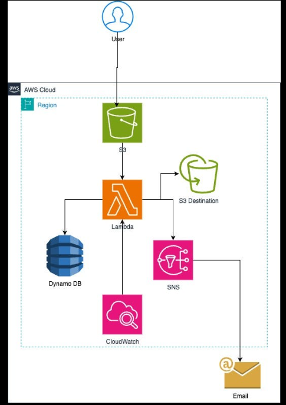

# 🚀 Serverless File Event Notification System using AWS

## 📌 Project Overview
This project is a **serverless, event-driven system** built on AWS that automatically detects file uploads and deletions in an S3 bucket and sends real-time notifications via SNS.

It uses AWS services like **S3, Lambda, DynamoDB, SNS, and CloudWatch** to create a scalable and automated workflow.

---

## 🧠 Architecture Diagram

---

## ⚙️ Workflow Explanation

1. 👤 User uploads or deletes a file in **Amazon S3**
2. 📦 S3 triggers an event notification
3. ⚡ AWS Lambda function is triggered automatically
4. 🧠 Lambda processes the event:
   - Extracts file name and event type
   - Stores metadata in DynamoDB
5. 📊 Logs are stored in **CloudWatch**
6. 📩 Notification is sent via **SNS**
7. 📧 User receives email alert

---

## 🛠️ Technologies Used

- ☁️ AWS S3 (Storage & Event Trigger)
- ⚡ AWS Lambda (Serverless Compute)
- 🗄️ DynamoDB (NoSQL Database)
- 📩 AWS SNS (Notification Service)
- 📊 CloudWatch (Monitoring & Logs)
- 🐍 Python (Boto3 SDK)

---

## 📂 Project Structure
